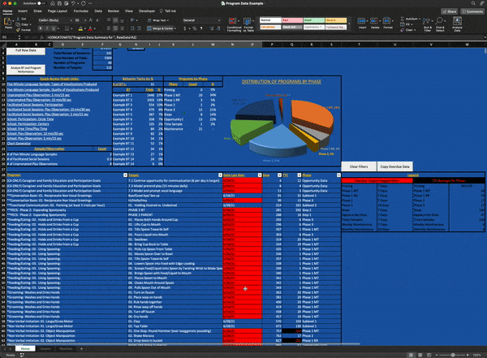

[![LinkedIn][linkedin-shield]][linkedin-url]

 

<h3 align="center">Clinical Program Data Analysis Tool</h3>

  

    This tool was built for an agency that designs and manages treatment programs for individuals with autism. The macro is designed to take a CSV input and build an Excel data analysis dashboard along with the ability to automatically generate graphs. It is written to run on MacOS.
     
     
    

      <a href="https://www.youtube.com/watch?v=gebyKPzP-SM">View Demo</a>
    

  

 

<!-- TABLE OF CONTENTS -->

  
Table of Contents

  <ol>
    <li>
      <a href="#about-the-project">About The Project</a>
      <ul>
        <li><a href="#built-with">Built With</a></li>
      </ul>
    </li>
    <li><a href="#getting-started">Getting Started</a></li>
    <li><a href="#usage">Usage</a></li>
    <li><a href="#contact">Contact</a></li>
  </ol>

 

<!-- ABOUT THE PROJECT -->

## About The Project

This project was built for [Behavioral and Educational Strategies and Training (B.E.S.T.)](https://www.bestforautism.com/) to facilitate a change to digital data collection. The macro takes raw data in the form of a CSV file and creates a dashboard that highlights information pertinent to clinical decision making. The macro also generates a sheet dedicated to generating graphs automatically.

(<a href="#top">back to top</a>)

### Built With

* [Visual Basic for Applications (VBA)](https://docs.microsoft.com/en-us/office/vba/library-reference/concepts/getting-started-with-vba-in-office)

(<a href="#top">back to top</a>)

<!-- GETTING STARTED -->
## Getting Started

The macro is designed to work specifically with a CSV file generated by a third-party vendor. With the macro open and the CSV workbook active, the user can press `Command (⌘)` + `Option (⌥)` + `P` to generate the <em>Program Data</em> dashboard or `Command (⌘)` + `Option (⌥)` + `B` for the <em>Behavior Data</em> dashboard.

(<a href="#top">back to top</a>)

<!-- USAGE EXAMPLES -->
## Usage

The following demo GIF shows some of the program's basic functionality.

(<a href="#top">back to top</a>)

<!-- CONTACT -->
## Contact

Jonathan Bryant - jbryant9@gmail.com, spectrum19tech@gmail.com

Project Link: [https://github.com/Jonathan-Bryant19/clinical-program-data-analysis](https://github.com/Jonathan-Bryant19/clinical-program-data-analysis)

(<a href="#top">back to top</a>)

<!-- MARKDOWN LINKS & IMAGES -->
<!-- https://www.markdownguide.org/basic-syntax/#reference-style-links -->
[linkedin-shield]: https://img.shields.io/badge/-LinkedIn-black.svg?style=for-the-badge&logo=linkedin&colorB=555
[linkedin-url]: https://www.linkedin.com/in/jonathan-bryant19/
[product-screenshot]: images/screenshot.png
